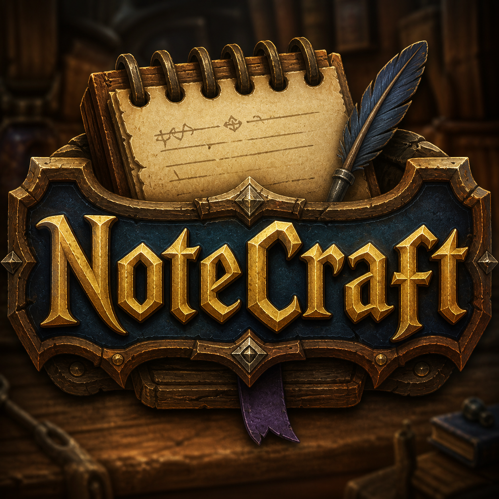

  

# NoteCraft

A World of Warcraft addon for **Midnight** (12.0.x) that tracks who you've played
with, remembers Mythic+ outcomes per player, and lets you attach personal notes
and color-coded tags. Designed for the Group Finder / Mythic+ era.

> **Privacy:** NoteCraft is **100% local**. It never sends data to any server,
> never broadcasts to other addons, and never reads from the internet. All data
> lives in your `SavedVariables` and disappears when you uninstall.

---

## Features

- **Mythic+ outcome history.** Each completed key is recorded per group member
  as either *positive* (in time) or *negative* (depleted / abandoned). The
  per-player counter goes up only when a run actually finishes, not when you
  merely queue together.
- **Free-text notes + color tags.** Attach a note ("solid healer, good comms")
  and a tag — built-ins are `GOOD`, `BAD`, `CAUTION`, `NEUTRAL`, plus you can
  create your own with a custom color from the options panel.
- **Role tracking.** Per-player Tank / Healer / DPS counters from every shared
  run, so you remember which spec someone usually plays.
- **Tooltip injection everywhere.** Hover any player and see your note, tag,
  M+ record, role split, and how many runs you've shared. Works on the unit
  tooltip, friends list, /who results, guild roster, communities list, and
  the LFG group browser.
- **LFG screening.** Applicants you already know are highlighted with a
  colored border and your note shown inline.
- **Chat hyperlink menu.** Right-click a player's name in chat for a quick
  add-note / quick-tag / view-history menu.
- **Post-M+ popup.** After every key (success or surrender) a small dialog
  lets you tag and note each party member at once.
- **End-of-key banner overlay.** Tagged members are highlighted on the
  challenge-mode end banner.
- **Tagged-player alert.** Get a chat warning + raid-warning + sound when
  somebody you flagged BAD or CAUTION joins your group.
- **Mini-window with search & filters.** `/nc list` opens a searchable list
  with tag / outcome / realm filters, plus a Stats tab for aggregates.
- **Minimap button + 4 keybindings** (Esc → Key Bindings → AddOns → NoteCraft).
- **Export / Import.** Back up or move your data via a copyable string
  (compressed, no server involved).

---

## Installation

**Recommended (auto-update):** install through the
[CurseForge App](https://www.curseforge.com/download/app) or
[WowUp](https://wowup.io/).

**Manual:**

1. Download the latest release from CurseForge or GitHub.
2. Extract the `NoteCraft` folder into
   `World of Warcraft/_retail_/Interface/AddOns/`.
3. Restart WoW or `/reload`.

---

## Slash commands

| Command | Effect |
| --- | --- |
| `/nc` or `/notecraft` | Open the main window |
| `/nc list` | Same as `/nc` |
| `/nc add <Name-Realm> <text>` | Set a note for a player |
| `/nc tag <Name-Realm> <tagId\|->` | Set or clear a tag |
| `/nc tags` | List all available tags |
| `/nc show <Name-Realm>` | Show a player's record in chat |
| `/nc export` | Open the export dialog (copyable string) |
| `/nc import <data>` | Open the import dialog (paste a string) |
| `/nc config` | Open the options panel |

---

## FAQ

**Does it share my data with anyone?**
No. Everything is local to your machine. The export feature produces a string
you can copy *manually* — it never auto-sends.

**Will my notes survive a character transfer or rename?**
The current encounter record is keyed by `Name-Realm`. After a rename, the old
record stays under the old key. A `/nc merge` command is planned post-MVP.

**What about Classic / Wrath / Cataclysm Classic?**
Not supported in v0.1.x. Mythic+ tracking depends on retail-only APIs.

**How is "in time" / "not in time" determined?**
NoteCraft listens for `CHALLENGE_MODE_COMPLETED` and reads the `onTime` flag
directly from the game. Abandons (`CHALLENGE_MODE_RESET` / surrenders detected
via zone change while a key was pending) count as negative.

---

## Branding / project art

The NoteCraft logo lives at [`Media/logo.png`](Media/logo.png). It is shipped
with the addon (used as the AddOns-list icon and the minimap button) and
referenced from this README.

**To attach it to the CurseForge project page** (CurseForge does not pull art
automatically from the repo):

1. Go to your project on `authors.curseforge.com` → *Project Page*.
2. Upload `Media/logo.png` as the **Avatar** (square, ≥ 64×64).
3. Upload the same file (or a wider variant) as **Project Logo** under
   *Settings → General → Project Logo* if you want a banner on the public page.
4. Optionally add it to the **Image Gallery** so users see it in the project
   listing carousel.

Same image works for **Wago.io**: *Project Settings → Project Image*.

---

## License

[MIT](LICENSE) — © 2026 Roberto Cinque.

### Bundled libraries

NoteCraft embeds the following community libraries (each remains under its own
license):

- [Ace3](https://www.wowace.com/projects/ace3) — addon framework.
- [LibSerialize](https://github.com/rossnichols/LibSerialize) — serialization.
- [LibDeflate](https://github.com/SafeteeWoW/LibDeflate) — compression.
- [LibDataBroker-1.1](https://github.com/tekkub/libdatabroker-1-1) +
  [LibDBIcon-1.0](https://www.wowace.com/projects/libdbicon-1-0) — minimap
  button.
- LibDropDownExtension-1.0 (RaiderIO authors) — adds entries to legacy
  `UIDropDownMenu` popups (used by the chat right-click menu in current WoW).

---

## Contributing

Issues and pull requests welcome on GitHub. Please describe how to reproduce
bugs and which addons were enabled.
